# Doctor Tracker Web


## Elevator Pitch

Doctor Tracker is a secure administrative portal for managing doctors and their patients. This repository is its web client: a responsive Next.js dashboard where an authenticated admin can create and browse doctors, manage each doctor's patients, search and filter every list with shareable URLs, and read the numbers at a glance through analytics charts. It is built around a fast, calm user experience: debounced search, pagination that never flashes empty, clear loading, empty and error states, dark mode, and keyboard-friendly accessibility.

| | |
|---|---|
| **Live app** | `https://doctor-tracker-web-gamma.vercel.app` |
| **Live API** | `https://doctor-tracker-api-cx5r.onrender.com` (health check: `/api/health`) |
| **Backend repository** | `https://github.com/mdmaksudurrahman/doctor-tracker-api` |
| **Demo login** | Email: `admin@doctortracker.com` / Password: `Admin@12345` |

> The API runs on Render's free tier, which sleeps after about 15 minutes without traffic. The first request can take 30 to 60 seconds. The app shows a "this is taking longer than usual" notice when that happens, so a slow first load is expected.

---

## Table of Contents

1. [Features](#features)
2. [Tech Stack](#tech-stack)
3. [Setup Guide](#setup-guide)
4. [System Architecture](#system-architecture)
5. [Technical Decisions](#technical-decisions)
6. [Visual Evidence](#visual-evidence)
7. [Performance and Accessibility](#performance-and-accessibility)
8. [Git Workflow and CI](#git-workflow-and-ci)
9. [Deployment](#deployment)
10. [Known Limitations and Next Steps](#known-limitations-and-next-steps)

---

## Features

- **Authentication:** login page, session held in an `httpOnly` cookie, and route protection that redirects visitors without a session to `/login` (returning them to the page they wanted after signing in). Expired sessions are handled automatically.
- **Dashboard:** total doctors and patients, new records in a selectable range (7 days, 30 days, 90 days, 1 year), average patients per doctor, the busiest doctor, a daily trend chart, patients per doctor, patients by condition, patients by gender, and doctors by specialization.
- **Doctors:** searchable, filterable (specialization, hospital, date range), sortable and paginated list. Create a doctor from a dialog, open a detail page, or delete a doctor (with a clear warning that their patients are deleted too).
- **Patients under a doctor:** on the doctor's page, search, paginate, add and delete that doctor's patients.
- **Patients page:** every patient across all doctors, with search, filters (condition, gender, doctor, date range), sorting and pagination. Edit a patient, including moving them to another doctor, or delete them.
- **Shareable state:** all search terms, filters, sorting, page numbers and the dashboard range live in the URL. Links can be bookmarked and shared, and the browser's Back button works as expected.
- **UX details:** debounced search, skeleton loaders, empty states with helpful actions, retryable error states, toast notifications, confirmation dialogs for destructive actions, a responsive sidebar that becomes a drawer on mobile, tables that turn into cards on small screens, and light, dark and system themes.

## Tech Stack

| Area | Technology |
|---|---|
| Framework | Next.js 16 (App Router) with React 19 and the React Compiler |
| Language | TypeScript |
| Styling | Tailwind CSS 4, shadcn/ui (Radix primitives), lucide-react icons |
| Server state | TanStack Query |
| Forms and validation | React Hook Form with Zod |
| Charts | Recharts |
| Theming | next-themes |
| Notifications | Sonner |
| Dates | date-fns |
| CI | GitHub Actions (lint, type-check, build) |
| Hosting | Vercel (frontend), Render (API), MongoDB Atlas (database) |

---

## Setup Guide

### Prerequisites

- [Node.js](https://nodejs.org/) 20 or newer
- Git
- The backend running locally or deployed. See the [backend repository](https://github.com/mdmaksudurrahman/doctor-tracker-api) for its setup (Docker MongoDB, `npm run seed:admin`, `npm run seed`, `npm run dev`).

### 1. Clone and install

```bash
git clone https://github.com/mdmaksudurrahman/doctor-tracker-web.git
cd doctor-tracker-web
npm install
```

### 2. Configure the environment

Copy the example file:

```bash
# macOS / Linux
cp .env.example .env.local

# Windows PowerShell
Copy-Item .env.example .env.local
```

`.env.example`:

```env
# Base URL of the Express API, no trailing slash
API_URL=http://localhost:5000
```

| Variable | Description |
|---|---|
| `API_URL` | Where the Next.js server forwards `/api/*` requests. Use `http://localhost:5000` for a local backend, or the deployed API URL. |

The app does not call the API directly from the browser. It calls its own `/api/*` path and Next.js forwards the request (see [Technical Decision 1](#decision-1-proxy-the-api-through-nextjs-instead-of-calling-it-cross-origin)). `API_URL` is read when the app is built and started, so restart the dev server after changing it.

### 3. Run the app

Start the backend first, then:

```bash
npm run dev
```

Open `http://localhost:3000` and sign in with the admin account created by the backend's `seed:admin` script. To confirm the proxy works, open `http://localhost:3000/api/health`, which should return `{"status":"ok"}`.

### Available scripts

| Script | Purpose |
|---|---|
| `npm run dev` | Start the development server with hot reload |
| `npm run build` | Create a production build |
| `npm start` | Serve the production build |
| `npm run lint` | Run ESLint |

### Project structure

```
src/
  app/
    (app)/              pages that share the app shell (sidebar and top bar)
      page.tsx            dashboard
      doctors/            list and [id] detail
      patients/           list
      layout.tsx          shell layout
      error.tsx           error boundary for these pages
    login/              login page (no shell)
    layout.tsx          root layout: providers, fonts, metadata
    not-found.tsx       404 page
    global-error.tsx    last-resort error page
  components/
    ui/                 shadcn/ui primitives (generated)
    layout/             sidebar, top bar, theme toggle, user menu, slow-request notice
    shared/             reusable pieces: pagination, search input, filter select,
                        confirm dialog, empty and error states, form field, page header
    auth/               login form
    doctors/            doctor table, filters, form, dialogs, detail, patients section
    patients/           patient table, filters, form, dialogs, page view
    dashboard/          stat cards, charts, dashboard view
  hooks/                data hooks (use-doctors, use-patients, use-dashboard, use-auth)
                        and UI hooks (use-url-params, use-debounce)
  lib/                  API client, query keys, Zod schemas, formatting helpers
  providers/            React Query and theme providers
  types/                shared TypeScript types
  proxy.ts              route guard (redirects when there is no session cookie)
```

Route files stay thin. Logic lives in `components/` and `hooks/`, and pieces that more than one page needs live in `components/shared/`.

---

## System Architecture

### High-level view

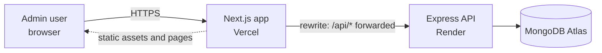

The browser only ever talks to the frontend's own origin. Pages and assets come from Next.js, and every `/api/*` request is forwarded by a Next.js rewrite to the Express API. The API sets the login cookie, and because the response arrives through the frontend's domain, the cookie belongs to the frontend.

### How a page loads data

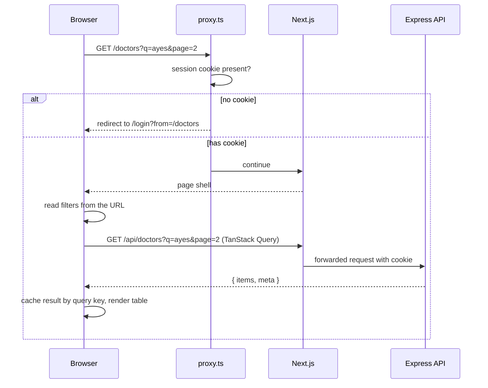

### Layers

| Layer | Responsibility |
|---|---|
| **Routes** (`app/`) | Declare pages and layouts. They contain almost no logic. |
| **Views** (`components/*-view.tsx`) | Read state from the URL, call data hooks, choose between loading, error, empty and data states. |
| **Hooks** (`hooks/`) | One place per resource for queries and mutations, including which caches each mutation invalidates. |
| **API client** (`lib/api.ts`) | One `fetch` wrapper: JSON handling, typed errors, friendly network errors, and redirect on an expired session. |
| **Shared components** | Reusable building blocks used by several pages. The Patients page reuses nearly everything the Doctors page introduced. |

### Data flow rules

- **Server data lives in TanStack Query.** Every query key includes its parameters, so each filter combination is cached separately and revisiting a page is instant.
- **List state lives in the URL.** Search, filters, sorting and page are read from the query string, and changed with `router.replace`.
- **Mutations invalidate by key.** Adding or deleting a doctor or patient invalidates the affected lists, dropdown options and the dashboard, so no screen shows stale counts.
- **Errors have one shape.** The API client turns failures into an `ApiError` with a status and optional field errors, which forms map back onto the right inputs.

---

## Technical Decisions

### Decision 1: Proxy the API through Next.js instead of calling it cross-origin

**Context.** The frontend is deployed on Vercel and the API on Render, which are different sites. The login session is an `httpOnly` cookie issued by the API. The simplest wiring is for the browser to call the Render URL directly, which makes the session cookie a third-party cookie from the frontend's point of view.

**Decision.** The browser calls `/api/*` on the frontend's own domain, and a Next.js rewrite forwards those requests to the API:

```ts
async rewrites() {
  return [{ source: "/api/:path*", destination: `${API_URL}/api/:path*` }];
}
```

**Why.**

- **The cookie stays first-party.** Browsers increasingly block or restrict third-party cookies, and a cross-site login that works today can silently fail in another browser or a future version. With the proxy, the cookie is set for the frontend's own domain and behaves like any ordinary session cookie.
- **Route protection can happen before rendering.** `proxy.ts` runs on the Next.js server and can read that cookie. A visitor without a session is redirected to `/login` before any protected page is sent, so there is no flash of private content. With a cross-site cookie, the Next.js server would never see it, and guards would have to run only in the browser.
- **No CORS in the browser.** Requests are same-origin, so there are no preflight requests, and the API's CORS allow-list is a second line of defence instead of a hard dependency.
- **The API URL is hidden from the client code.** It is read from `API_URL` on the server, and can change per environment without touching components.

**Trade-offs and how they are handled.**

- **An extra hop.** Each API call goes browser → Vercel → Render. For an admin portal with modest traffic that cost is small compared with the reliability gain.
- **`proxy.ts` only checks that a cookie exists.** It cannot verify the signature, because the secret lives on the API. That is deliberate: the API remains the real gatekeeper. If the cookie is expired or forged, the first API call returns 401 and the API client redirects to `/login`. The guard improves experience and avoids leaking page shells, while security stays on the server.
- **The rewrite target is fixed at build and start time.** Changing `API_URL` means redeploying.
- **The API sees Vercel's servers as the client.** The API's login rate limiter and `trust proxy` setting need to account for the forwarded client address, which is noted under limitations.

### Decision 2: TanStack Query for server data and the URL for list state, instead of Redux or Context

**Context.** Most of this app is lists: doctors, patients, and dashboard figures, all of which come from the API and are filtered, sorted and paginated. A typical first instinct is a global store (Redux) or React Context to hold the data and the filter values.

**Decision.** There is no global store. Two tools split the job:

- **TanStack Query** owns everything that comes from the server: caching, deduplication, loading and error status, retries, and invalidation after changes.
- **The URL** owns everything the user chooses on a list: search text, filters, sort order, page number and the dashboard range. A small hook, `useUrlParams`, is the only way pages read and change that state.

**Why not Redux or Context.**

- **Server data is a cache problem, not a state problem.** A store makes you write the loading flags, error handling, request deduplication, staleness rules and "refetch after save" logic by hand, and keep it in sync. TanStack Query provides all of that, and keys that include the parameters give per-filter caching for free.
- **Context would re-render everything that reads it.** Putting list data or filters in a context makes consumers update on every change, which fights the stated goal of avoiding unnecessary re-renders.
- **Filters in the URL beat filters in state.** A filtered view can be bookmarked and shared, a refresh keeps the user's place, and Back and Forward work. It also removes a whole class of bugs where a state copy and the URL disagree, because there is only one source of truth.

**How it behaves in practice.**

- Changing the page keeps the previous rows on screen, slightly dimmed, until the next page arrives (`keepPreviousData`), so lists never collapse into skeletons.
- Search is debounced by 400 ms, and the URL updates with `router.replace`, so typing doesn't create one history entry per keystroke.
- A change to any filter resets the page to 1 unless the page itself is being changed.
- Mutations invalidate by key (doctor lists, filter options, patient lists, dashboard), so counts stay consistent across screens.
- The only other shared state is the logged-in user, which is simply a cached query, and the theme, which `next-themes` manages.

**Trade-offs.**

- URL values are always strings and can be edited by hand, so every page parses them defensively: an invalid page number, sort or doctor id falls back to a default instead of breaking the page.
- Each filter change is a navigation, which needs the debounce and `replace` described above to feel smooth.
- A single dashboard request feeds all of its charts, which keeps the page fast, but the cache is per date range.

---

## Visual Evidence

All screenshots live in `docs/screenshots/`. Desktop shots are taken at about 1440 px wide, and mobile shots at 390 px wide.

### Login

| Desktop | Mobile |
|---|---|
| 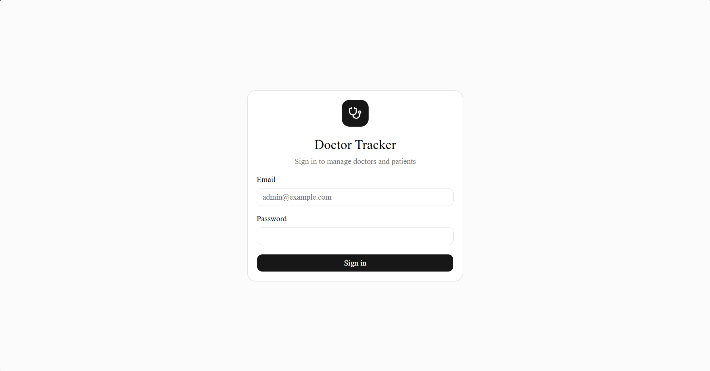 | 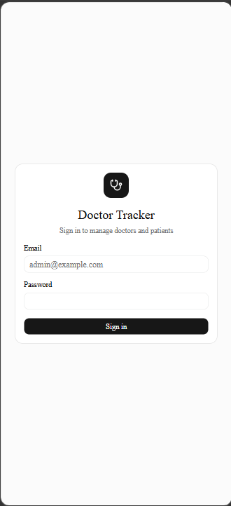 |

### Dashboard

| Desktop (light) | Desktop (dark) |
|---|---|
| 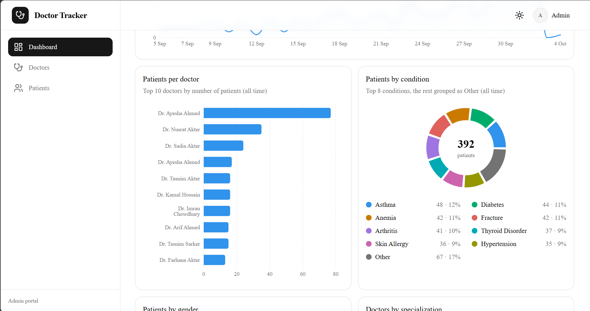 | 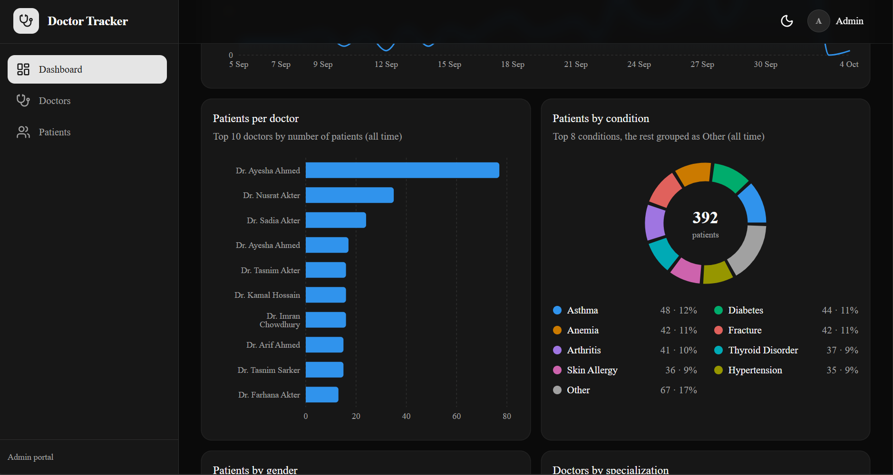 |

| Mobile |
|---|
| 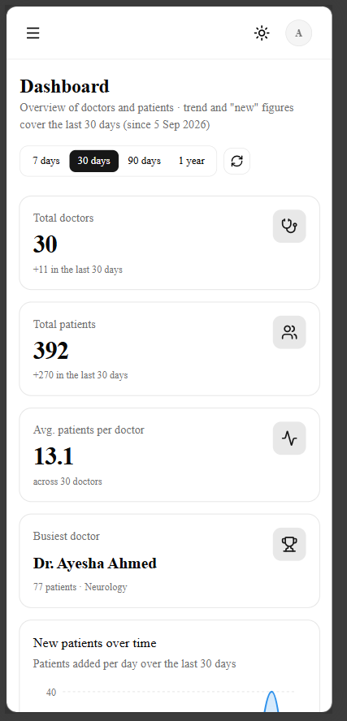 |

### Doctors

| Desktop: list with filters | Mobile: cards |
|---|---|
| 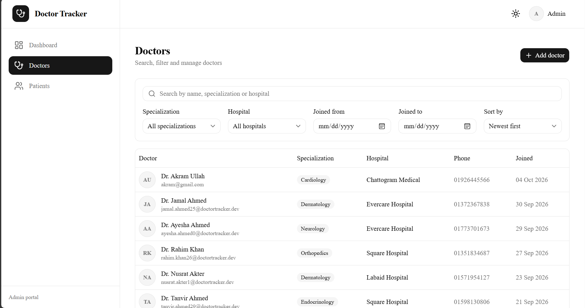 | 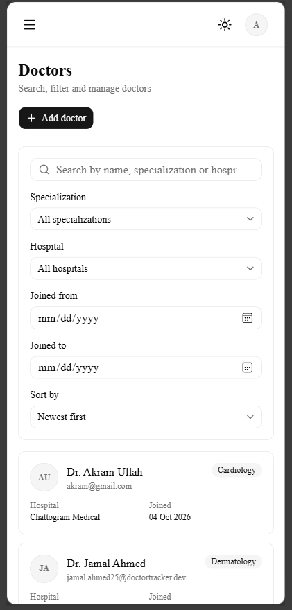 |

| Desktop: add doctor dialog | Desktop: doctor detail with patients |
|---|---|
| 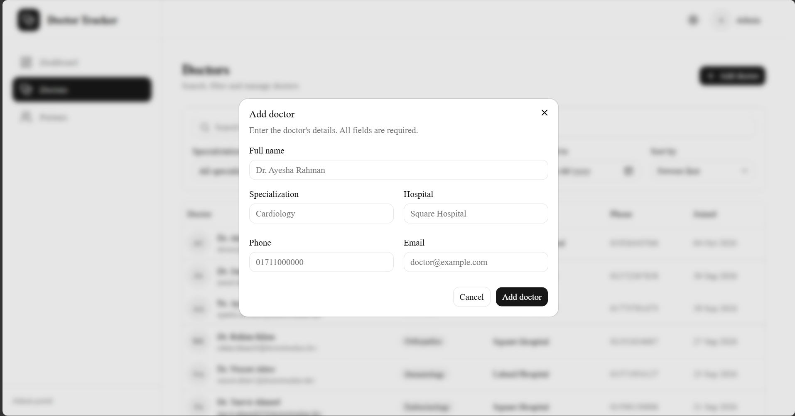 | 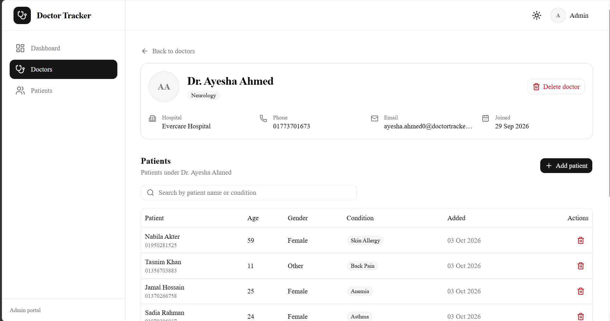 |

### Patients

| Desktop: list with filters | Mobile: cards |
|---|---|
| 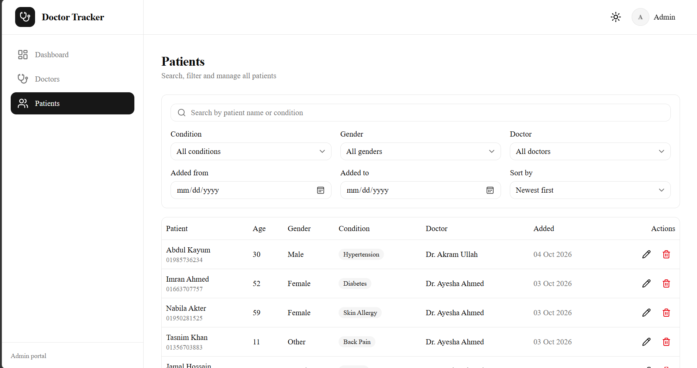 | 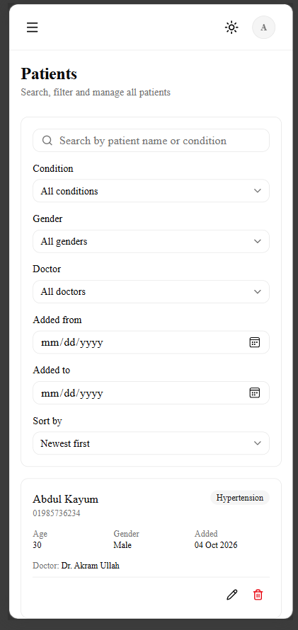 |

| Desktop: edit patient dialog | Desktop: delete confirmation |
|---|---|
| 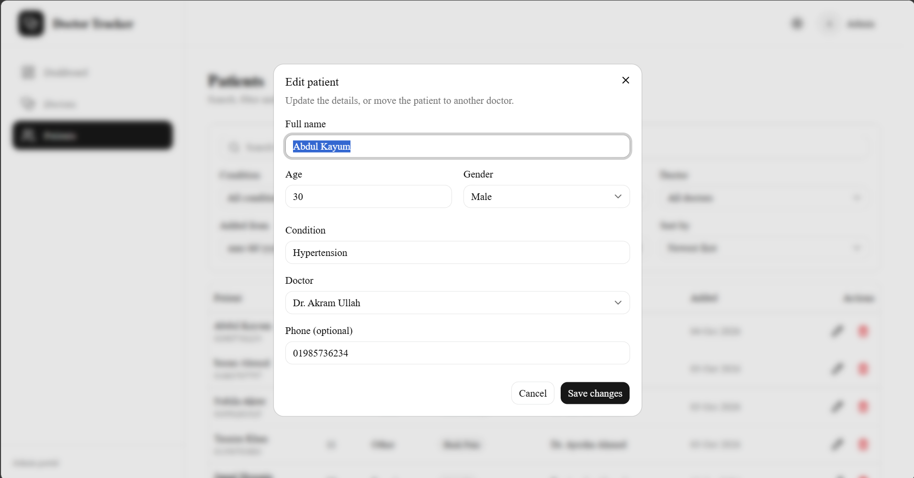 | 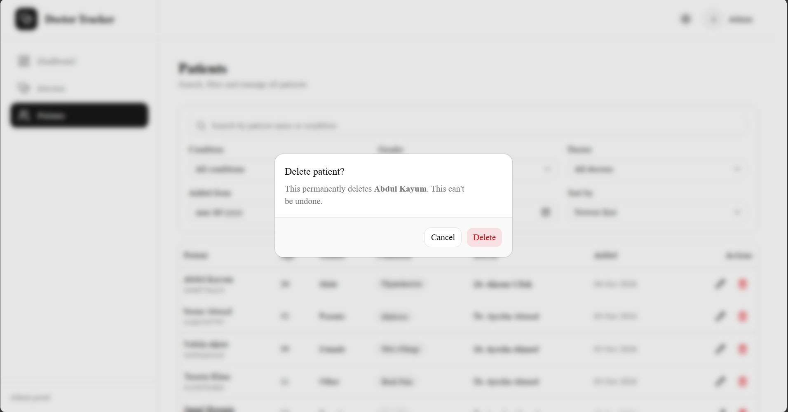 |

### Navigation and states

| Mobile: navigation drawer | Empty state |
|---|---|
| 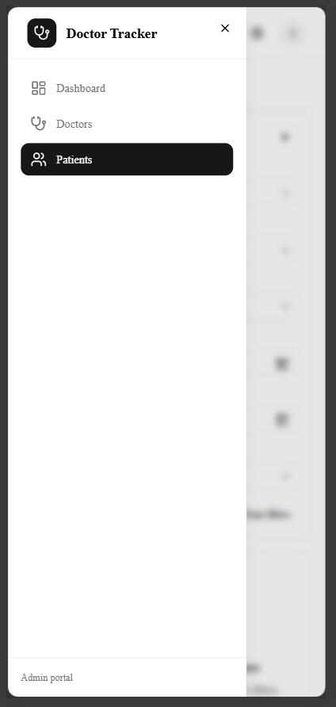 | 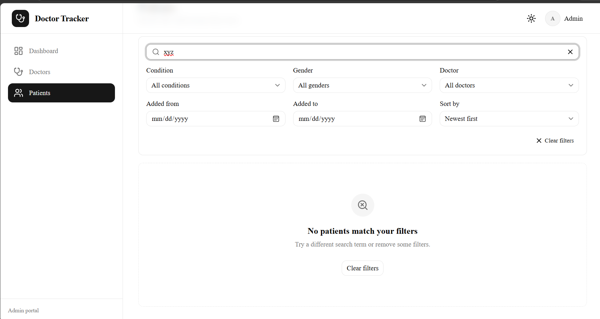 |

### Quality

| Lighthouse (mobile) |
|---|
| 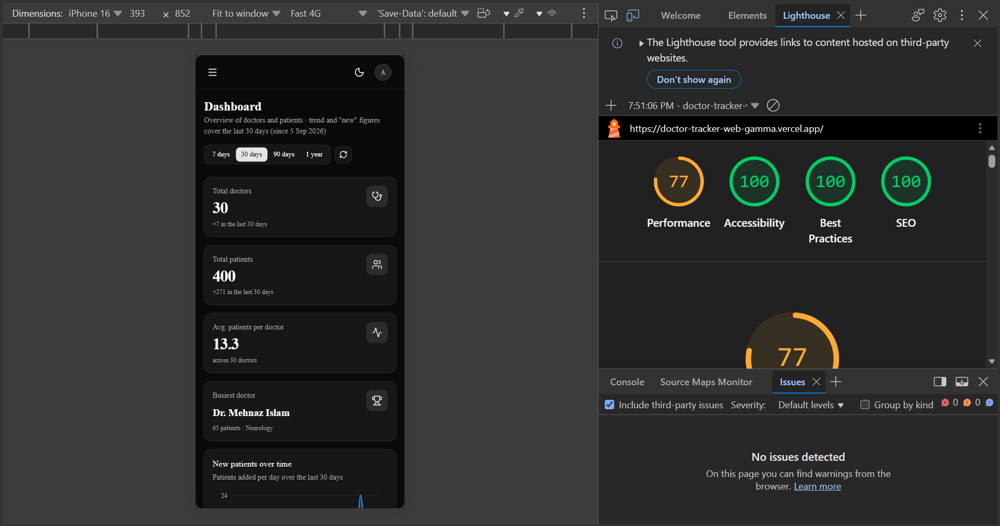 |

---

## Performance and Accessibility

**Performance**

- **React Compiler** is enabled, so components are memoized automatically instead of with hand-written `useMemo` and `useCallback`.
- **Charts are loaded on demand.** Recharts is the heaviest dependency, so each chart component is loaded with `next/dynamic` after the stat cards appear, and is excluded from other routes' bundles.
- **One request builds the dashboard.** The backend runs its aggregations in parallel and returns everything in a single response.
- **Per-key caching.** Every distinct filter combination is cached, so going back to a page you have already seen is instant, and unchanged filter dropdown data is cached for five minutes.
- **No wasted requests.** Search is debounced, empty filters are never sent, and client errors (400, 401, 404) are never retried.
- **No layout jumps.** Skeletons match the shape of the content they replace, and pagination keeps old rows visible while new ones load.

**Resilience**

- Network failures show a friendly message instead of a raw browser error, and server errors are retried twice before an error is shown.
- A notice explains slow responses caused by free-tier hosting waking up.
- Route-level and root-level error boundaries keep a crash from blanking the whole app, and unknown URLs get a proper 404 page.
- Every list has a loading, an empty, and an error state, and the error state always offers a retry.

**Accessibility**

- Every form control has a label, errors are announced with `role="alert"`, and invalid fields set `aria-invalid`.
- A "Skip to content" link appears for keyboard users, and the sidebar marks the current page with `aria-current`.
- Dialogs trap focus and return it to the trigger when closed. Destructive actions always need confirmation.
- Result counts are announced politely to screen readers, tables have captions, and each chart has a text summary for assistive technology.
- Animations are minimised when the operating system asks for reduced motion.

**Security headers.** The app sets `X-Content-Type-Options`, `X-Frame-Options`, `Referrer-Policy` and `Permissions-Policy`, and removes the `X-Powered-By` header.

---

## Git Workflow and CI

- `main`: production. Vercel deploys from it. It only receives merges from `dev`.
- `dev`: integration branch. It receives merges from feature branches.
- `feature/*`: one branch per module (`feature/setup`, `feature/auth`, `feature/app-shell`, `feature/doctors-list`, `feature/doctor-detail`, `feature/patients-page`, `feature/dashboard`, `feature/polish`).
- Every change reaches `dev` and `main` through a pull request, and branch protection requires the CI check to pass first.
- Commits follow Conventional Commits (`feat:`, `fix:`, `chore:`, `docs:`, `ci:`).

The GitHub Actions workflow (`.github/workflows/ci.yml`) runs on every push and pull request to `dev` and `main`. It installs dependencies with `npm ci`, then runs lint, a TypeScript type-check and a production build.

---

## Deployment

### Frontend: Vercel

1. Import the `doctor-tracker-web` repository in Vercel. The Next.js preset is detected automatically.
2. Set the production branch to `main`.
3. Add the environment variable `API_URL` with the deployed API address, for example `https://doctor-tracker-api-cx5r.onrender.com` (no trailing slash).
4. Deploy.

### Backend: connect the two

In the API's Render service, set `CLIENT_URL` to the exact deployed frontend origin (for example `https://doctor-tracker-web.vercel.app`, with no trailing slash), then let it redeploy. See the [backend repository](https://github.com/mdmaksudurrahman/doctor-tracker-api) for its full deployment notes.

### Smoke test after deploying

1. Open `https://<your-app>.vercel.app/api/health`. It should return `{"status":"ok"}`, which proves the rewrite reaches the API.
2. Sign in with the demo account.
3. Check that the dashboard shows data and that adding a patient updates the totals.

---

## Known Limitations and Next Steps

| Limitation | Next step |
|---|---|
| The doctor dropdowns on the Patients page load at most 50 doctors, which is the API's page cap | Replace with a searchable combobox that queries as you type |
| Clearing a patient's phone number does not remove the stored value, because the form omits empty fields and the API validates phone only when it is sent | Let the API accept an empty value or `null` for phone |
| Dates are grouped and filtered in UTC | Pass the user's time zone to the API |
| `proxy.ts` checks only that a session cookie exists | Intentional. The API verifies the token, and an invalid session redirects on the first request |
| The API sees all frontend traffic as coming from the hosting provider, which affects IP-based rate limiting | Forward the real client address and configure the API's trusted proxy depth |
| No Content-Security-Policy | Add a nonce-based policy |
| No automated frontend tests yet. Quality gates are lint, type-check and build in CI | Unit tests for formatting helpers, Zod schemas and `useUrlParams`, plus component tests with Testing Library |
| Mutations wait for the server before updating the UI | Optimistic updates for deletes and edits |
| The first request after idle can take up to a minute on free hosting | Paid hosting, or an uptime monitor pinging `/api/health` |

---

## License

MIT